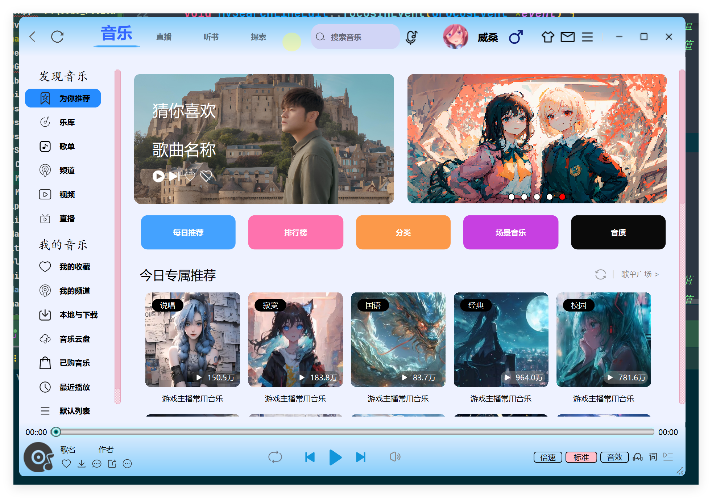
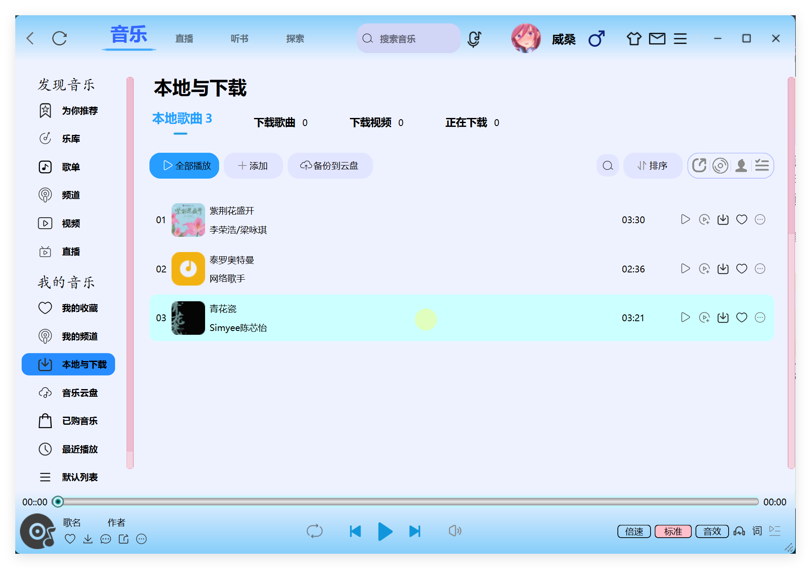

# 高仿酷狗音乐客户端

### 软件说明
Qt版本 ：Qt6.6.2         
编译环境 ：Mingw        
开发工具 ：CLion        
生成器 ： Ninja        

### 介绍
Based on Qt Widget + UiTools module+ Custom control +QSS
使用CMake进行模块化管理，参照酷狗酷狗客户端，高仿并且优化界面，QMediaPlayer和QAudioOutput来实现音频播放，提供更好的音乐播放体验，有着丰富的自定义控件和事件响应，解决诸多难题如：遮罩绘图，控件拉伸，绘制特效，页面切换动画等。

### 图例

