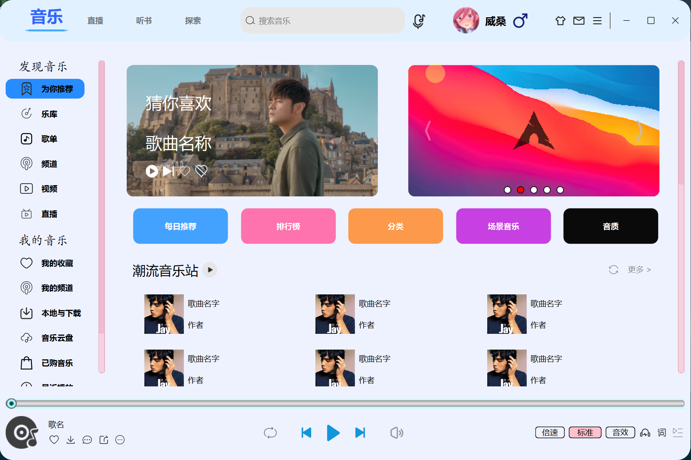

# 高仿酷狗音乐客户端

#### 介绍
Based on Qt Widget + dialog+ model-view framework+ MySql + UiTools module+ Custom control + json 
analysis + QSS
使用CMake进行模块化管理，参照酷狗酷狗客户端，高仿并且优化界面，QMediaPlayer和QAudioOutput来实现音频播
放，提供更好的音乐播放体验，有着丰富的

#### 图例

